<div align="center">
  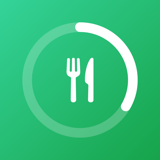
  <h1>CalorieFlow — iOS</h1>
  <p>บันทึกแคลอรี่และน้ำ พร้อมโค้ชโภชนาการที่ทำงานในเครื่องล้วน ๆ<br>ไม่ต่อเน็ต ไม่มีบัญชี ข้อมูลไม่ออกจากเครื่อง</p>
  <p>
    
    
    
  </p>
</div>

พอร์ตมาจาก [CalorieFlow](https://github.com/ChakkritGit/CalorieFlow) เวอร์ชันเว็บ
(React + Vite + Tailwind) เป็นแอป iOS เนทีฟด้วย SwiftUI

---

## หน้าตาแอป

ภาพทั้งหมดถ่ายจากแอปที่รันจริงบน iPhone 17 Pro (iOS 27) ธีมมืด ไม่ได้ทำขึ้นใหม่

พื้นผิวทั้งแอปมาจาก `Components/Theme.swift` ที่เดียว — สีเป็น dynamic `UIColor`
รัศมีมุมไล่ลดหลั่นตามขนาดของสิ่งที่มันครอบ (การ์ด → ตัวควบคุม → ชิป) และธีมมืด
แยกชั้นด้วยความสว่างของพื้นผิวกับเส้นขอบแทนเงา เพราะเงาบนพื้นมืดอ่านเป็นคราบ
ไม่ใช่ความสูง

### หน้าหลัก

<p>
  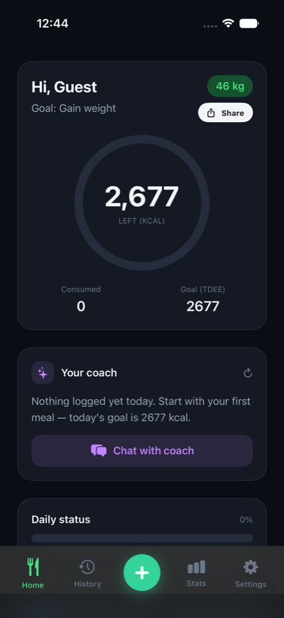
  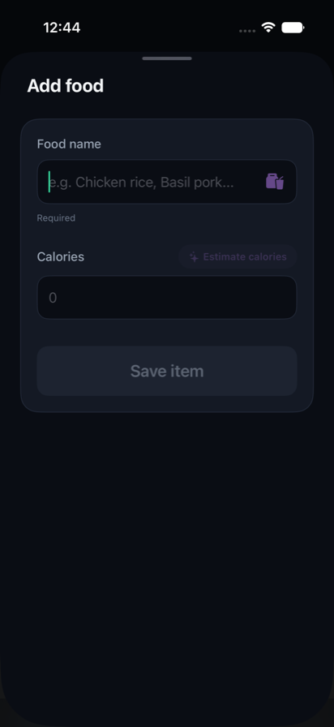
</p>

วงแหวนบอกแคลอรี่ที่เหลือ ใต้ลงมาเป็นสถานะรวมของวัน น้ำที่ดื่ม และรายการอาหาร
การ์ดโค้ชอยู่บนสุดเพราะเป็นสิ่งที่ควรอ่านก่อนตัดสินใจมื้อถัดไป

เพิ่มอาหารผ่านปุ่ม **+** ตรงกลางแถบล่าง ถ้าไม่รู้ว่าเมนูนั้นกี่แคลอรี่ กด
**ประมาณแคลอรี่** ให้โมเดลเดาให้ แล้วแก้ทับได้เสมอ

### ประวัติและสถิติ

<p>
  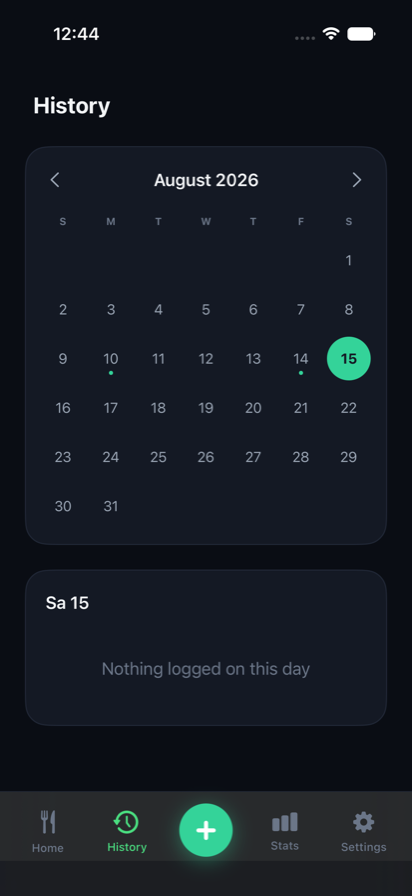
  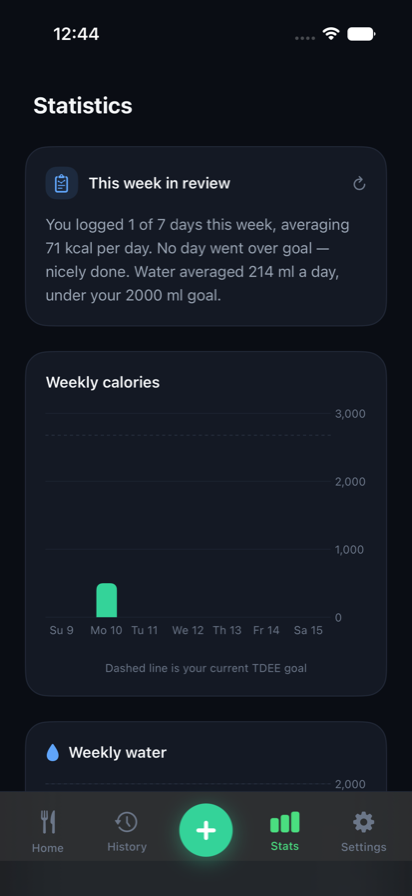
</p>

จุดเขียวบนปฏิทินขึ้นเฉพาะวันที่มีข้อมูลจริง วงกลมทึบคือวันที่เลือก วงขอบจาง ๆ คือวันนี้ —
สองสถานะนี้เกิดพร้อมกันได้จึงต้องแยกให้ออก ส่วนหน้าสถิติมีกราฟ 7 วันย้อนหลังพร้อม
เส้นประบอกเป้าหมาย และสรุปสัปดาห์ที่โค้ชเขียนให้

### ตั้งค่า

<p>
  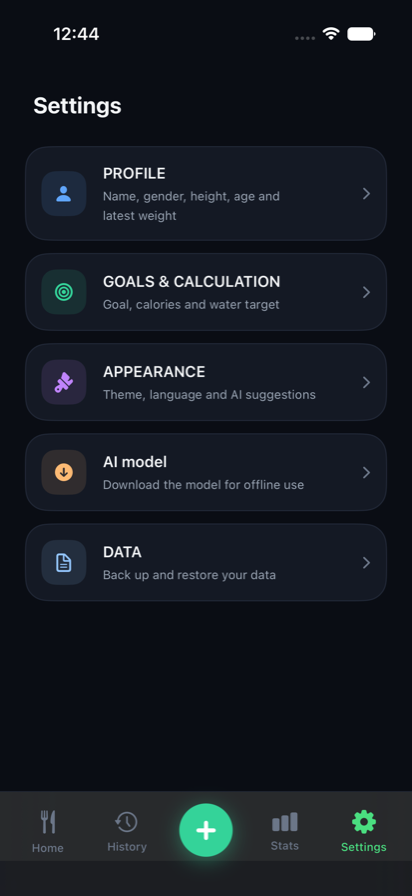
  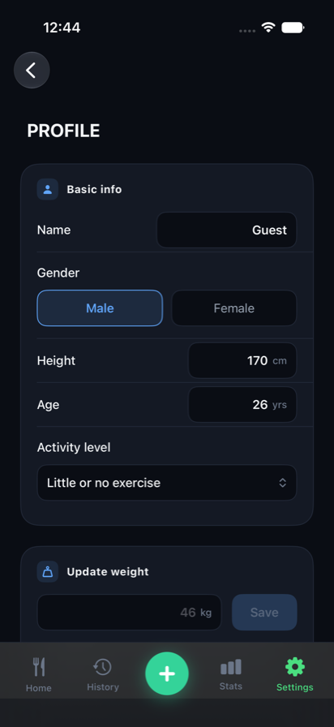
  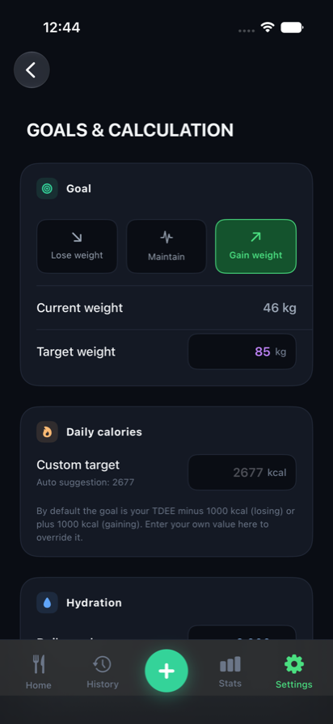
</p>
<p>
  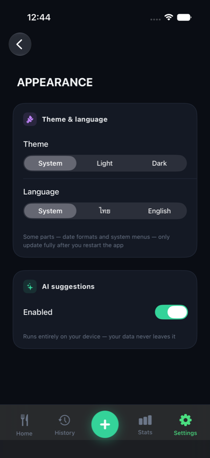
  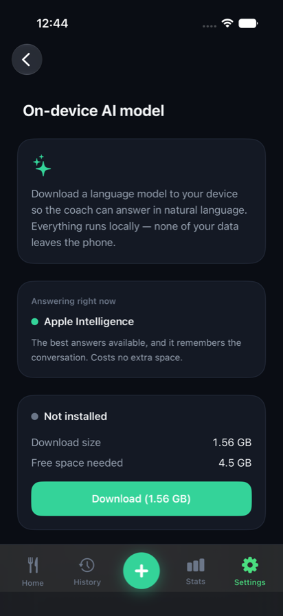
  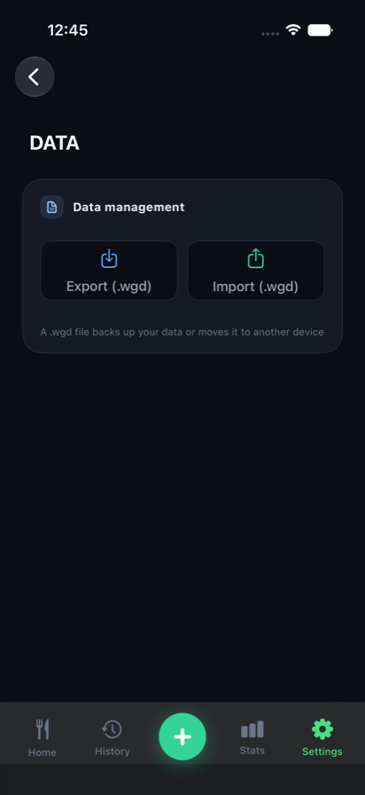
</p>

แยกเป็นห้าหมวด กดเข้าไปตั้งค่าอีกชั้น ทุกหน้าใช้โครงเดียวกัน — หัวเรื่องอยู่ในเนื้อหา
แถบบนเหลือแค่ปุ่มย้อนกลับ ไม่มีข้อความและไม่มีเส้นแบ่ง

ธีมมีตามระบบ / สว่าง / มืด · ภาษามีตามระบบ / ไทย / English · ข้อมูลสำรองเป็นไฟล์
`.wgd` ไฟล์เดียวกับเวอร์ชันเว็บ ย้ายข้ามเครื่องหรือข้ามแพลตฟอร์มได้

โมเดล AI โหลดเมื่ออยากได้ ไม่โหลดก็ใช้แอปได้ครบ โค้ชจะเปลี่ยนไปให้คำแนะนำแบบ
กฎธรรมดาแทน — ขนาดเขียนไว้บนปุ่มตั้งแต่ก่อนกด เพราะกว่าหนึ่งกิกะไบต์ควรเป็นการ
ตัดสินใจที่เห็นตัวเลขก่อน

## โค้ชทำงานยังไง

มี backend สามชั้น ไล่ลงมาเรื่อย ๆ จนกว่าจะมีตัวที่ตอบได้ **ทุกชั้นทำงานในเครื่องทั้งหมด**

| ชั้น | ใช้เมื่อ | ได้อะไร |
| --- | --- | --- |
| **Foundation Models** | iOS 26+ และเปิด Apple Intelligence ไว้ | คุณภาพดีที่สุด ไม่กินพื้นที่เพิ่ม |
| **Core ML** (Qwen2.5-1.5B int8) | โหลดโมเดลมาแล้ว | ตอบเป็นภาษาธรรมชาติได้ ใช้พื้นที่ 1.6 GB |
| **RuleBasedAdvisor** | ไม่มีสองตัวบน | ข้อความสำเร็จรูปตามสถานการณ์ ใช้ได้ทุกเครื่อง |

โค้ชโผล่สี่จุด: การ์ดหน้าหลัก · สรุปรายสัปดาห์ในหน้าสถิติ · ปุ่มประมาณแคลอรี่ตอนกรอกอาหาร ·
หน้าแชท — ทั้งสี่จุดไล่ backend ชุดเดียวกัน

`Services/AICoach.swift` เป็นจุดเดียวที่คุยกับโมเดล เพิ่ม backend ใหม่ไม่ต้องแตะ view เลย

---

## เริ่มใช้งาน

```bash
open CalorieFlow.xcodeproj
```

ต้องใช้ **Xcode 26 ขึ้นไป** และ **iOS 18 ขึ้นไป** (stateful Core ML กับ int4/int8
เป็นของใหม่ใน iOS 18) ก่อนรันบนเครื่องจริงให้ตั้ง Signing Team และเปลี่ยน
`PRODUCT_BUNDLE_IDENTIFIER` เป็นของคุณเอง

โปรเจกต์ใช้ file-system synchronized group ของ Xcode — ไฟล์ทุกไฟล์ในโฟลเดอร์
`CalorieFlow/` ถูกคอมไพล์อัตโนมัติ ไม่ต้องเพิ่มเข้า target เอง

> **โมเดล Core ML รันบน simulator ไม่ได้** — Espresso ในตัว simulator ถูก build มา
> โดยไม่มีเอนจิน MPSGraph จะได้ error `-14` ตอนสร้าง execution plan
> ต้องทดสอบบนเครื่องจริง ส่วนฟีเจอร์อื่นทั้งหมดใช้ simulator ได้ตามปกติ

### ถ้าจะโฮสต์โมเดลเอง

`otherData/convert.py` แปลง Qwen2.5-1.5B-Instruct เป็น Core ML แบบ stateful (รันบน Colab)
แล้วอัปสามไฟล์ที่ได้ขึ้นที่ไหนสักที่ที่โหลดตรงได้

```
Qwen-int8.mlpackage.zip
tokenizer.json
tokenizer_config.json
```

จากนั้นแก้ `ModelDownloader.downloadBaseURL` ให้ชี้ไปที่นั่น — ที่เหลือทำงานเอง

---

## โครงสร้างโค้ด

| ไฟล์ | หน้าที่ | เทียบกับเวอร์ชันเว็บ |
| --- | --- | --- |
| `Models/Models.swift` | `UserProfile`, `DailyLog`, `FoodItem` | `src/types/types.ts` |
| `Services/Calculations.swift` | TDEE (Mifflin-St Jeor) + คีย์วันที่ตามเวลาเครื่อง | `calculateTDEE` |
| `Services/AppStore.swift` | สถานะกลาง + บันทึกลง JSON + สตรีค + สรุปรายสัปดาห์ | `useState` + IndexedDB |
| `Services/AICoach.swift` | ไล่ backend สามชั้น — จุดเดียวที่คุยกับโมเดล | — |
| `Services/CoreMLBackend.swift` | รันโมเดล stateful + tokenizer + sampling | — |
| `Services/ModelDownloader.swift` | ดาวน์โหลด แตก zip คอมไพล์ ลบไฟล์กลาง | — |
| `Services/Preferences.swift` | ธีมและภาษา เก็บใน UserDefaults | — |
| `Resources/Strings.swift` | ตารางข้อความไทย/อังกฤษ (`L10n`) | ข้อความไทยฝังในโค้ด |
| `Views/RootView.swift` | `TabView` + แถบล่างที่วาดเอง | `<nav>` + `TabButton` |
| `Views/DashboardView.swift` | วงแหวนแคลอรี่ สตรีค น้ำ รายการวันนี้ | `renderDashboard` |
| `Views/HistoryView.swift` | ปฏิทิน + สรุปรายวัน | `renderHistory` |
| `Views/StatsView.swift` | กราฟ 7 วัน (Swift Charts) | `renderStats` (Recharts) |
| `Views/SettingsView.swift` | หมวดหมู่ + หน้าย่อย | `renderSettings` |
| `Views/WrappedStoryView.swift` | สรุปประจำปีแบบสตอรี่ | `WrappedStory` |
| `Views/ShareCardView.swift` | การ์ดแชร์ 375×667 | html2canvas |

### สิ่งที่เปลี่ยนวิธีทำ แต่ผลลัพธ์เหมือนเดิม

| เว็บ | iOS |
| --- | --- |
| IndexedDB | ไฟล์ JSON ใน Application Support |
| html2canvas | `ImageRenderer` |
| `navigator.share()` | `UIActivityViewController` |
| `<input type="file">` | `.fileImporter` |
| Recharts | Swift Charts |
| ฟอนต์ Anuphan | ฟอนต์ระบบ (รองรับไทยอยู่แล้ว) |

---

## ข้อตัดสินใจที่มีเหตุผลอยู่เบื้องหลัง

- **ไม่ใช้ `NSLocalizedString`** — มันผูกกับภาษาของระบบ สลับในแอปไม่ได้ถ้าไม่รีสตาร์ท
  จึงเก็บข้อความไว้ใน `L10n` แล้วส่งผ่าน environment key `\.l10n` แทน
- **ธีมคุมที่ `UIWindow.overrideUserInterfaceStyle`** ไม่ใช่ `.preferredColorScheme` —
  `Palette` เป็น dynamic `UIColor` ซึ่ง resolve จาก trait ของ UIKit ส่วน
  `preferredColorScheme` เขียนแค่ environment ของ SwiftUI สีจึงไม่ตาม
- **แถบแท็บวาดเองทับ `TabView` ที่ซ่อนแถบมาตรฐาน** — เพราะ `TabView` วางปุ่ม +
  ทรงกลมยกกลางไม่ได้ แต่ยังอยากได้ state และตำแหน่ง scroll แยกต่อแท็บที่มันให้มา
- **การ์ดแชร์กับหน้า Wrapped ใช้สีคงที่** — เป็นภาพที่ส่งออกนอกแอป ไม่ควรเปลี่ยนตามธีมคนส่ง
- **launch screen เป็น storyboard** — Xcode เปิดให้ตั้งผ่าน `INFOPLIST_KEY_` แค่สองคีย์
  ส่วนสีพื้นหลังกับรูปอยู่ใน dict ซ้อนซึ่งกลไกนั้นแปลงให้ไม่ได้

รายละเอียดของบั๊กที่เจอระหว่างแปลงโมเดล Core ML (สี่ตัว ทุกตัวพังแบบเงียบ ไม่มี error)
อยู่ใน [`HANDOFF.md`](HANDOFF.md) และในคอมเมนต์ของ `LLM/convert.py` ตรงจุดที่แก้

---

## ความเข้ากันได้ของไฟล์สำรอง

ไฟล์ `.wgd` ที่ส่งออกจากเวอร์ชันเว็บนำเข้าในแอป iOS ได้เลย ตัวถอดรหัสรองรับ ISO8601
ทั้งแบบมีและไม่มีเศษวินาที (JavaScript `toISOString()` ใส่มิลลิวินาทีมาด้วย) และถอยไปใช้
ค่าเริ่มต้นเมื่อฟิลด์หายหรือชนิดไม่ตรง

## ที่ยังไม่ได้ทำ

- ยังไม่ได้ทดสอบ `CoreMLBackend` บนเครื่องจริง (simulator รันไม่ได้ด้วยเหตุผลข้างบน)
- คุณภาพภาษาไทยของโมเดล 1.5B ยังสู้ภาษาอังกฤษไม่ได้ — ถ้าอยากดันต่อ ลอง
  `EMBEDDING_POLICY = "untie"` ใน `convert.py` ซึ่งเว้น embedding ไว้ที่ fp16
- ฟอนต์ Anuphan — ถ้าอยากให้ตรงกับเว็บเป๊ะ ต้องเพิ่ม `INFOPLIST_KEY_UIAppFonts`
